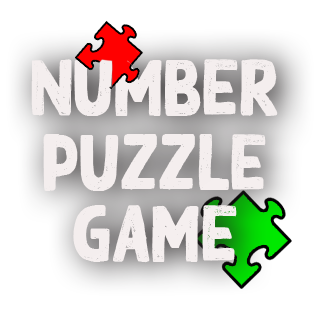

 

  

  <h3 align="center">Number-Puzzle Game</h3>

  

    A single-player number puzzle game.
     
    <a href="https://github.com/Afrokk/Number-Riddle-Puzzle-Game"><strong>Check it out.»</strong></a>
     
  

## About The Project

A single-player number puzzle game made in vanilla C. Hardcore stuff.

## Built With

Designed and built in vanilla C. 

[![C][C.com]][C-url]

## How it works
The Number Puzzle game works by utilizing char array generated in sequence, then randomized and printed in a matrix form according to input from the user. We then use the location of the characters and empty cell to move and swap the values, and selection structures to define conditions and constraints.

  

### Winning Message:

  

## Contact

Afrasiyab (Afrokk) Khan -  [afrokk.design](https://afrokk.design/home) - [LinkedIn](https://www.linkedin.com/in/afrasiyab-k/) - [@afrokk_](https://www.instagram.com/afrokk_/) - afrasiyabkhan379@gmail.com

ANOTHER PROJECT: Check out <strong>Vintage Autohaus</strong>: [https://github.com/Afrokk/Vintage-Autohaus](https://github.com/Afrokk/Vintage-Autohaus)

[C.com]: https://img.shields.io/badge/c-%2300599C.svg?style=for-the-badge&logo=c&logoColor=white
[C-url]: https://en.wikipedia.org/wiki/C_(programming_language)
